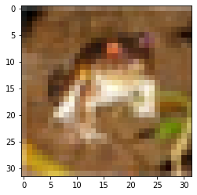
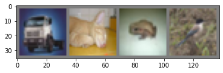
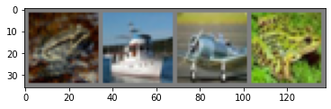

# Image Classification Model on CIFAR10 Dataset
### Author: Gabriel Tardochi Salles
```python
import torch
import torch.nn as nn
import torch.nn.functional as F
import torchvision
import torchvision.transforms as transforms
import matplotlib.pyplot as plt
import numpy as np
import torch.optim as optim
```

Lets just download CIFAR10 train and test dataset and create dataloader objects.


```python
# grabbing cuda if available
device = torch.device("cuda:0" if torch.cuda.is_available() else "cpu")
```


```python
# images to cuda.tensor and normalizing values to [-1, 1] range on each one of the 3 channels(R,G,B)
transform = transforms.Compose(
    [transforms.ToTensor(),
     transforms.Normalize((0.5, 0.5, 0.5), (0.5, 0.5, 0.5))])

trainset = torchvision.datasets.CIFAR10(root='./data', train=True,
                                        download=True, transform=transform)
testset = torchvision.datasets.CIFAR10(root='./data', train=False,
                                       download=True, transform=transform)

trainloader = torch.utils.data.DataLoader(trainset, batch_size=4,
                                          shuffle=True, num_workers=2)
testloader = torch.utils.data.DataLoader(testset, batch_size=4,
                                         shuffle=True, num_workers=2)

classes = ('plane', 'car', 'bird', 'cat',
           'deer', 'dog', 'frog', 'horse', 'ship', 'truck')
```

    Files already downloaded and verified
    Files already downloaded and verified
    

Visualizing image number of channels, shape and normalization


```python
# Grab a sample image
tensor, label = trainset[0]
print(tensor.shape)
print(tensor)
```

    torch.Size([3, 32, 32])
    tensor([[[-0.5373, -0.6627, -0.6078,  ...,  0.2392,  0.1922,  0.1608],
             [-0.8745, -1.0000, -0.8588,  ..., -0.0353, -0.0667, -0.0431],
             [-0.8039, -0.8745, -0.6157,  ..., -0.0745, -0.0588, -0.1451],
             ...,
             [ 0.6314,  0.5765,  0.5529,  ...,  0.2549, -0.5608, -0.5843],
             [ 0.4118,  0.3569,  0.4588,  ...,  0.4431, -0.2392, -0.3490],
             [ 0.3882,  0.3176,  0.4039,  ...,  0.6941,  0.1843, -0.0353]],
    
            [[-0.5137, -0.6392, -0.6235,  ...,  0.0353, -0.0196, -0.0275],
             [-0.8431, -1.0000, -0.9373,  ..., -0.3098, -0.3490, -0.3176],
             [-0.8118, -0.9451, -0.7882,  ..., -0.3412, -0.3412, -0.4275],
             ...,
             [ 0.3333,  0.2000,  0.2627,  ...,  0.0431, -0.7569, -0.7333],
             [ 0.0902, -0.0353,  0.1294,  ...,  0.1608, -0.5137, -0.5843],
             [ 0.1294,  0.0118,  0.1137,  ...,  0.4431, -0.0745, -0.2784]],
    
            [[-0.5059, -0.6471, -0.6627,  ..., -0.1529, -0.2000, -0.1922],
             [-0.8431, -1.0000, -1.0000,  ..., -0.5686, -0.6078, -0.5529],
             [-0.8353, -1.0000, -0.9373,  ..., -0.6078, -0.6078, -0.6706],
             ...,
             [-0.2471, -0.7333, -0.7961,  ..., -0.4510, -0.9451, -0.8431],
             [-0.2471, -0.6706, -0.7647,  ..., -0.2627, -0.7333, -0.7333],
             [-0.0902, -0.2627, -0.3176,  ...,  0.0980, -0.3412, -0.4353]]])
    


```python
# function to show an image
def imshow(img):
    img = img / 2 + 0.5     # unnormalize
    npimg = img.numpy()
    plt.imshow(np.transpose(npimg, (1, 2, 0)))
    plt.show()

# view last printed tensor image and correct label
print(classes[label])
imshow(tensor)
```

    frog
    


    

    


```python
# get a batch of images
dataiter = iter(trainloader)
images, labels = dataiter.next()

# show images
imshow(torchvision.utils.make_grid(images))
# print labels
print('           '.join('%5s' % classes[labels[j]] for j in range(4)))
```


    

    


    truck             cat            frog            bird
    

### Creating the Convolutional Neural Network


```python
class CNN(nn.Module):
    def __init__(self):
        super(CNN, self).__init__()
        self.cv1 = nn.Conv2d(3, 32, 5)
        self.pool = nn.MaxPool2d(2, 2)
        self.cv2 = nn.Conv2d(32, 16, 5)
        self.fc1 = nn.Linear(16 * 5 * 5, 120)
        self.fc2 = nn.Linear(120, 84)
        self.fc3 = nn.Linear(84, 10)  # 10 possible classes

    def forward(self, x):
        x = self.pool(F.relu(self.cv1(x)))  # using ReLU as activation func, then pooling on results
        x = self.pool(F.relu(self.cv2(x)))  # using ReLU as activation func, then pooling on results
        x = x.view(-1, 16 * 5 * 5)
        x = F.relu(self.fc1(x))
        x = F.relu(self.fc2(x))
        x = self.fc3(x)  # Criterion is CrossEntropyLoss, its ok to leave it like that
        return x

mdl = CNN().to(device)
```

Setting the loss function and selecting an optimizer


```python
criterion = nn.CrossEntropyLoss()
optimizer = optim.SGD(mdl.parameters(), lr=0.001, momentum=0.9)
```

Training and evaluating the model


```python
min_val_loss = None
best_mdl = None
len_trainset = len(trainset)
len_testset = len(testset)
early_stop_count = 0
for epoch in range(5):  # loop over the dataset multiple times
    print("\nEPOCH:", epoch)
    train_running_loss = 0
    val_running_loss = 0
    mdl.train()
    for i, data in enumerate(trainloader, 0):
        inputs, labels = data[0].to(device), data[1].to(device)
        optimizer.zero_grad()
        outputs = mdl(inputs)
        loss = criterion(outputs, labels)
        loss.backward()
        optimizer.step()
        train_running_loss += loss.item()
    train_avg_loss = train_running_loss/len_trainset
    
    with torch.no_grad():
        mdl.eval()
        val_running_loss = 0
        for i, data in enumerate(testloader, 0):
            inputs, labels = data[0].to(device), data[1].to(device)
            outputs = mdl(inputs)
            val_loss = criterion(outputs, labels).item()
            val_running_loss += loss.item()
    val_avg_loss = val_running_loss/len_testset
            
    print(f"  Train loss: {train_avg_loss}\nValid loss: {val_avg_loss}")
    if min_val_loss == None or val_avg_loss < min_val_loss:
        min_val_loss = val_avg_loss
        best_mdl = mdl.state_dict()
    else:
        early_stop_count += 1
    if early_stop_count == 2:
        print("Early stopping on epoch", epoch)
        break

print('Finished Training')
```

    
    EPOCH: 0
      Train loss: 0.4043166980192065
    Valid loss: 0.5750203132629395
    
    EPOCH: 1
      Train loss: 0.31004984851405026
    Valid loss: 0.2807096540927887
    
    EPOCH: 2
      Train loss: 0.26638707899354397
    Valid loss: 0.0513790100812912
    
    EPOCH: 3
      Train loss: 0.2402659968927689
    Valid loss: 0.15363189578056335
    
    EPOCH: 4
      Train loss: 0.22185621606528527
    Valid loss: 0.2877337634563446
    Early stopping on epoch 4
    Finished Training
    


```python
torch.save(best_mdl, './cifar10_cnn.pth')
```


```python
dataiter = iter(testloader)
images, labels = dataiter.next()

# print images
imshow(torchvision.utils.make_grid(images))
print('GroundTruth: ', ' '.join('%5s' % classes[labels[j]] for j in range(4)))
```


    

    


    GroundTruth:   frog  ship plane  frog
    


```python
mdl = CNN()
mdl.load_state_dict(torch.load('./cifar10_cnn.pth'))
mdl.to(device)
```


    CNN(
      (cv1): Conv2d(3, 32, kernel_size=(5, 5), stride=(1, 1))
      (pool): MaxPool2d(kernel_size=2, stride=2, padding=0, dilation=1, ceil_mode=False)
      (cv2): Conv2d(32, 16, kernel_size=(5, 5), stride=(1, 1))
      (fc1): Linear(in_features=400, out_features=120, bias=True)
      (fc2): Linear(in_features=120, out_features=84, bias=True)
      (fc3): Linear(in_features=84, out_features=10, bias=True)
    )


```python
outputs = mdl(images.to(device))
```


```python
_, predicted = torch.max(outputs, 1)

print('Predicted: ', ' '.join('%5s' % classes[predicted[j]]
                              for j in range(4)))
```

    Predicted:   frog  ship plane  frog
    


```python
correct = 0
total = 0
with torch.no_grad():
    mdl.eval()
    for data in testloader:
        images, labels = data[0].to(device), data[1].to(device)
        outputs = mdl(images)
        _, predicted = torch.max(outputs.data, 1)
        total += labels.size(0)
        correct += (predicted == labels).sum().item()

print('Accuracy of the network on the 10000 test images: %d %%' % (
    100 * correct / total))
```

    Accuracy of the network on the 10000 test images: 66 %
    


```python
class_correct = list(0. for i in range(10))
class_total = list(0. for i in range(10))
with torch.no_grad():
    mdl.eval()
    for data in testloader:
        images, labels = data[0].to(device), data[1].to(device)
        outputs = mdl(images)
        _, predicted = torch.max(outputs, 1)
        c = (predicted == labels).squeeze()
        for i in range(4):
            label = labels[i]
            class_correct[label] += c[i].item()
            class_total[label] += 1

for i in range(10):
    print('Accuracy of %5s : %2d %%' % (
        classes[i], 100 * class_correct[i] / class_total[i]))
```

    Accuracy of plane : 76 %
    Accuracy of   car : 79 %
    Accuracy of  bird : 53 %
    Accuracy of   cat : 43 %
    Accuracy of  deer : 62 %
    Accuracy of   dog : 57 %
    Accuracy of  frog : 81 %
    Accuracy of horse : 70 %
    Accuracy of  ship : 70 %
    Accuracy of truck : 71 %
    

